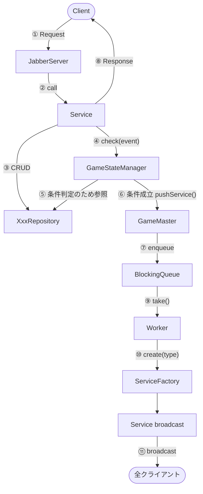
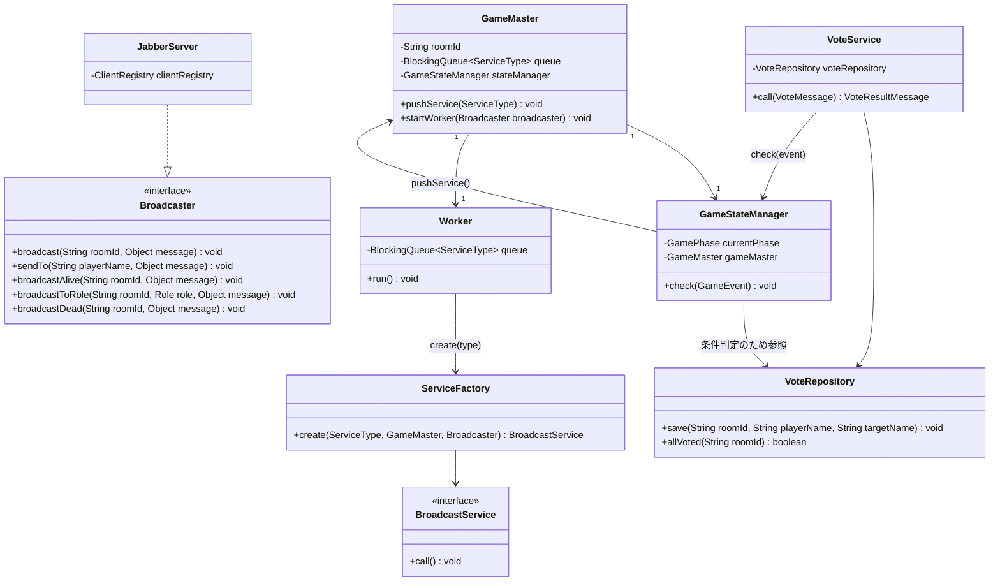
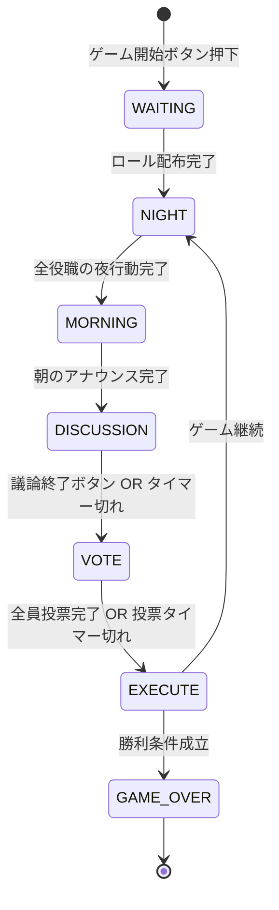
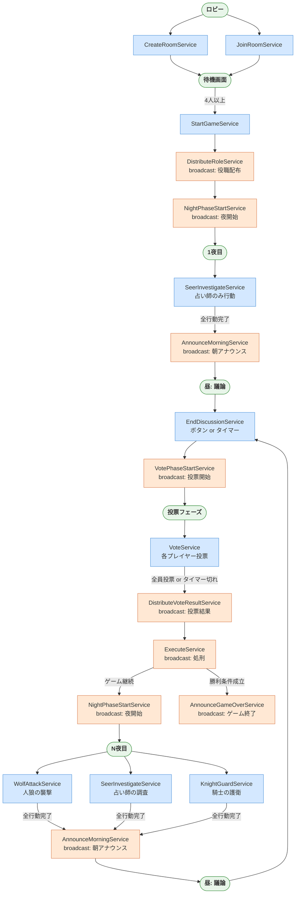

# 人狼ゲーム

TCP ソケット通信による人狼ゲームの**サーバー＋GUIクライアント**実装です。

## クイックスタート

```powershell
# 1. コンパイル
pwsh scripts/compile.ps1

# 2. サーバー起動（別ターミナル）
pwsh scripts/run.ps1 -Target server

# 3. クライアント起動（プレイヤー数分）
pwsh scripts/run.ps1 -Target client
```

> 最低4人のプレイヤーが参加するとゲームを開始できます。

---

## タスク一覧

| タスク | 概要 |
|--------|------|
| [基盤・アーキテクチャ](docs/tasks/基盤・アーキテクチャ.md) | ゲーム全体を支えるサーバーの基盤実装。Service の呼び出し・状態管理・非同期配信の仕組みを担う |
| [ルーム管理](docs/tasks/ルーム管理.md) | ゲーム開始前のロビー操作。ルームの作成・参加・削除を担う |
| [ゲーム開始・役職配布](docs/tasks/ゲーム開始・役職配布.md) | ホストがゲームを開始し、各プレイヤーに役職をランダムに配布するフェーズ |
| [夜フェーズ（役職行動）](docs/tasks/夜フェーズ（役職行動）.md) | 各役職がそれぞれの行動を行う。全役職の行動が揃い次第、朝へ自動遷移する |
| [朝のアナウンス](docs/tasks/朝のアナウンス.md) | 夜行動の結果を全プレイヤーに通知する。護衛と襲撃の照合・死亡処理・占い結果の個別通知を担う |
| [昼フェーズ（議論・投票・処刑）](docs/tasks/昼フェーズ（議論・投票・処刑）.md) | 昼フェーズは「議論 → 投票 → 処刑 → 勝利判定」という連鎖で構成される |
| [チャット](docs/tasks/チャット.md) | 3種類のチャットチャンネルが独立して動作する。送信先がチャンネルごとに異なる |

---

## プロジェクト構成

### client

GUIクライアント側のコードを格納するディレクトリです。

Swing で実装された GUI クライアント。サーバーと TCP 接続し、人狼ゲームをプレイします。
詳細は [docs/architecture.md](docs/architecture.md#client) を参照してください。

### server

サーバー側のコードを格納するディレクトリです.

`JabberServer` でクライアントからの接続を受け付け、適切な Service クラスを call します。
各 Service クラスは Request 引数を受け取って Request に応じた処理を行い、Response を返します。

```java
public class CreateRoomService {
    public CreateRoomResultMessage call(CreateRoomMessage message) {
        boolean success = roomRepository.create(message.roomId);
        return new CreateRoomResultMessage(success);
    }
}
```

---

## ゲームシステム設計

### アーキテクチャ全体図



### 方針

**クライアントリクエスト → 即時 Service 呼び出し**
- `Service.call(message) → ResultMessage` をそのまま使う
- Service 内で Repository を通じてデータを CRUD し、最後に `GameStateManager.check(event)` を呼ぶ

**GameStateManager.check()**
- `currentPhase` と渡された `GameEvent` をもとに、Repository からデータを読んで条件を判定する
- 条件成立なら `GameMaster.pushService(ServiceType.Xxx)` でエンキューのみ行う
- データは自分でキャッシュせず、常に Repository から読む

**サーバー起点イベント → Queue 経由**
- Worker ループが Queue から取り出し、`ServiceFactory` 経由で Service を実行して全クライアントに broadcast する

**二重発火防止（タイマー + 条件の競合）**
- 「全員投票完了 OR 投票タイマー切れ」のような競合には `AtomicBoolean` で対応する

```java
private final AtomicBoolean voteResolved = new AtomicBoolean(false);

if (voteResolved.compareAndSet(false, true)) {
    gameMaster.pushService(ServiceType.DISTRIBUTE_VOTE_RESULT);
}
```

### 主要クラス

| クラス | 責務 |
|--------|------|
| `JabberServer` | クライアント接続の受付・即時 Service の呼び出し・`Broadcaster` インターフェースの実装 |
| `Broadcaster` | broadcast 系メソッドのインターフェース。`JabberServer` が実装し、Service に注入される |
| `ClientRegistry` | 接続中クライアントの `PrintWriter` と部屋ごとのプレイヤー集合を管理。broadcast の実体 |
| `Service`（各実装） | Repository で CRUD → `GameStateManager.check()` → Response を返す |
| `XxxRepository` | データの CRUD のみ。ゲームロジックを持たない |
| `GameStateManager` | `currentPhase` の保持・`check(event)` での条件判定・`pushService()` の呼び出し |
| `GameMaster` | `roomId` の保持・Queue と Worker の管理・`pushService()` の提供 |
| `Worker`（スレッド） | Queue を監視し、ServiceFactory 経由で Service を実行 |
| `ServiceFactory` | `ServiceType` → `BroadcastService` インスタンスの生成 |

### クラス図



### フェーズ遷移図



### フェーズと発火条件

| イベント | 発火条件 | 方式 |
|----------|----------|------|
| 夜フェーズ終了 → 朝へ | 全役職の夜行動完了 | `check(NIGHT_ACTION_SUBMITTED)` → `ANNOUNCE_MORNING` |
| 投票集計 | 全員投票完了 OR 投票タイマー切れ | `check(VOTE_SUBMITTED)` + AtomicBoolean → `DISTRIBUTE_VOTE_RESULT` |
| 議論終了 → 投票へ | ボタン押下 OR 議論タイマー切れ | `check(DISCUSSION_ENDED)` + AtomicBoolean → `VOTE_PHASE_START` |
| 処刑 → 勝利判定 | 投票集計完了後 | Queue 連鎖 (`EXECUTE`) |
| ゲーム終了 | 勝利条件成立 | Queue 連鎖 (`ANNOUNCE_GAME_OVER`) |

---

## ゲームフロー

### Service 呼び出しパターン

| 種別 | 説明 | 戻り値 |
|------|------|--------|
| **クライアント起点** | クライアントの Request を受けて即時実行 | Response を送信元に返す |
| **サーバー起点 (broadcast)** | Worker が Queue から取り出して実行 | 全クライアントへ broadcast |

### 全 Service 一覧

| Service | 起点 | 発火タイミング |
|---------|------|----------------|
| `CreateRoomService` | クライアント | ルーム作成ボタン押下 |
| `JoinRoomService` | クライアント | ルーム参加ボタン押下 |
| `DeleteRoomService` | クライアント | ルーム削除時 |
| `StartGameService` | クライアント | ゲーム開始ボタン押下 |
| `DistributeRoleService` | **サーバー (broadcast)** | StartGameService 完了後 → Queue |
| `NightPhaseStartService` | **サーバー (broadcast)** | DistributeRoleService 完了後、または ExecuteService でゲーム継続 → Queue 連鎖 |
| `WolfAttackService` | クライアント（人狼のみ） | 夜フェーズに人狼が襲撃対象を選択 |
| `SeerInvestigateService` | クライアント（占い師のみ） | 夜フェーズに占い師が調査対象を選択 |
| `KnightGuardService` | クライアント（騎士のみ） | 夜フェーズに騎士が護衛対象を選択 |
| `AnnounceMorningService` | **サーバー (broadcast)** | 全役職の夜行動完了 → `check(NIGHT_ACTION_SUBMITTED)` → Queue |
| `EndDiscussionService` | クライアント or タイマー | 議論終了ボタン押下 / 議論タイマー切れ |
| `VotePhaseStartService` | **サーバー (broadcast)** | EndDiscussionService 完了後 → Queue |
| `VoteService` | クライアント | 投票フェーズに各プレイヤーが投票 |
| `DistributeVoteResultService` | **サーバー (broadcast)** | 全員投票完了 or 投票タイマー切れ → `check(VOTE_SUBMITTED)` → Queue |
| `ExecuteService` | **サーバー (broadcast)** | DistributeVoteResultService 完了後 → Queue 連鎖 |
| `AnnounceGameOverService` | **サーバー (broadcast)** | ExecuteService で勝利条件成立 → Queue 連鎖 |
| `SendVillageChatService` | クライアント | 昼フェーズに生存プレイヤーがチャット送信 |
| `SendWolfChatService` | クライアント | 夜フェーズに人狼がチャット送信 |
| `SendGraveChatService` | クライアント | 死亡プレイヤーが墓場チャット送信 |

### ゲーム全体フロー



### GameStateManager.check() イベント一覧

| GameEvent | チェック条件 | 成立時の動作 |
|-----------|------------|----------------------------------|
| `NIGHT_ACTION_SUBMITTED` | 当該夜に必要な全役職の行動が完了した | `ANNOUNCE_MORNING` をキューに積む |
| `VOTE_SUBMITTED` | 全員投票完了 **または** 投票タイマー切れ | `DISTRIBUTE_VOTE_RESULT` をキューに積む（AtomicBoolean で一度だけ） |
| `DISCUSSION_ENDED` | 議論終了ボタン押下 **または** 議論タイマー切れ | フェーズを `VOTE` に更新（AtomicBoolean で一度だけ）。`VOTE_PHASE_START` のキュー投入は呼び出し元の `EndDiscussionService` が行う |

> **二重発火防止**: `AtomicBoolean.compareAndSet(false, true)` により、タイマーとボタン押下が競合しても Queue へは1度だけ積まれる。
