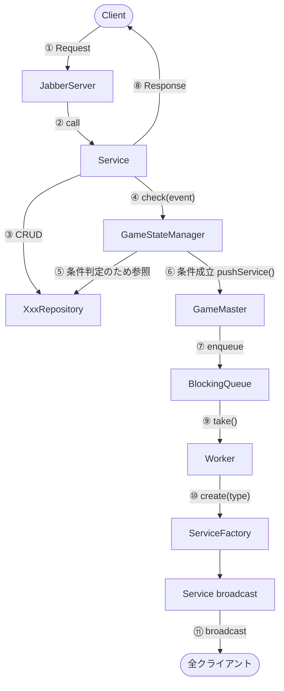
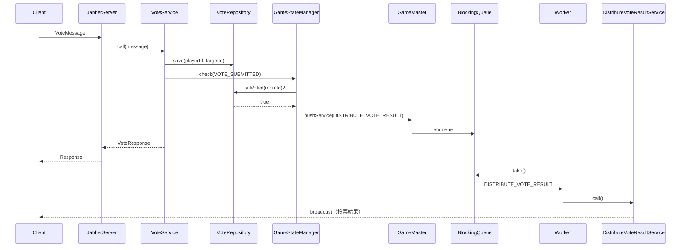
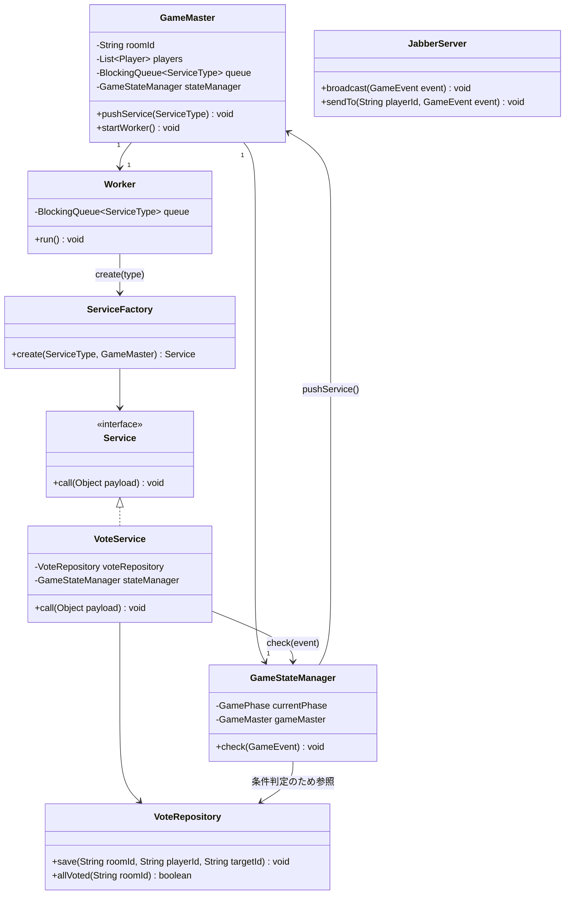
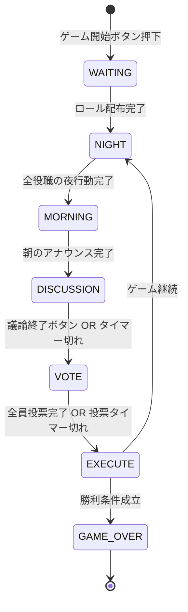

# プロジェクト構成

## server

サーバー側のコードを格納するディレクトリです.

`JabberServer` でクライアントからの接続を受け付け、適切な Service クラスを call します。
各 Service クラスは Request 引数を受け取って Request に応じた処理を行い、Response を返します。

```java
public class CreateRoomService {
    public CreateRoomResultMessage call(CreateRoomMessage message) {
        boolean success = roomRepository.create(message.roomId);
        return new CreateRoomResultMessage(success);
    }
}
```

```java
public class CreateRoomMessage {
    public String roomId;
}
```

```java
public class CreateRoomResultMessage {
    public boolean success;
}
```

---

## ゲームシステム設計

### アーキテクチャ全体図



### 方針

**クライアントリクエスト → 即時 Service 呼び出し**
- `Service.call(message) → ResultMessage` をそのまま使う
- Service 内で Repository を通じてデータを CRUD し、最後に `GameStateManager.check(event)` を呼ぶ

**GameStateManager.check()**
- `currentPhase` と渡された `GameEvent` をもとに、Repository からデータを読んで条件を判定する
- 条件成立なら `GameMaster.pushService(ServiceType.Xxx)` でエンキューのみ行う
- データは自分でキャッシュせず、常に Repository から読む

**サーバー起点イベント → Queue 経由**
- Worker ループが Queue から取り出し、`ServiceFactory` 経由で Service を実行して全クライアントに broadcast する

**二重発火防止（タイマー + 条件の競合）**
- 「全員投票完了 OR 投票タイマー切れ」のような競合には `AtomicBoolean` で対応する

```java
private final AtomicBoolean voteResolved = new AtomicBoolean(false);

if (voteResolved.compareAndSet(false, true)) {
    gameMaster.pushService(ServiceType.DISTRIBUTE_VOTE_RESULT);
}
```

### 主要クラス

| クラス | 責務 |
|--------|------|
| `JabberServer` | クライアント接続の受付・即時 Service の呼び出し・broadcast の実装 |
| `Service`（各実装） | Repository で CRUD → `GameStateManager.check()` → Response を返す |
| `XxxRepository` | データの CRUD のみ。ゲームロジックを持たない |
| `GameStateManager` | `currentPhase` の保持・`check(event)` での条件判定・`pushService()` の呼び出し |
| `GameMaster` | `roomId` / `players` などの設定保持・Queue と Worker の管理・`pushService()` の提供 |
| `Worker`（スレッド） | Queue を監視し、ServiceFactory 経由で Service を実行 |
| `ServiceFactory` | ServiceType → Service インスタンスの生成 |

### シーケンス図（投票フローの例）



### クラス図



### フェーズ遷移図



### フェーズと発火条件

| イベント | 発火条件 | 方式 |
|----------|----------|------|
| 夜フェーズ終了 → 朝へ | 全役職の夜行動完了 | check(NIGHT_ACTION_SUBMITTED) |
| 投票集計 | 全員投票完了 OR 投票タイマー切れ | check(VOTE_SUBMITTED) + AtomicBoolean |
| 議論終了 → 投票へ | ボタン押下 OR 議論タイマー切れ | check(DISCUSSION_ENDED) + AtomicBoolean |
| 処刑 → 勝利判定 | 投票集計完了後 | Queue 連鎖 |
| ゲーム終了 | 勝利条件成立 | Queue 連鎖 |
