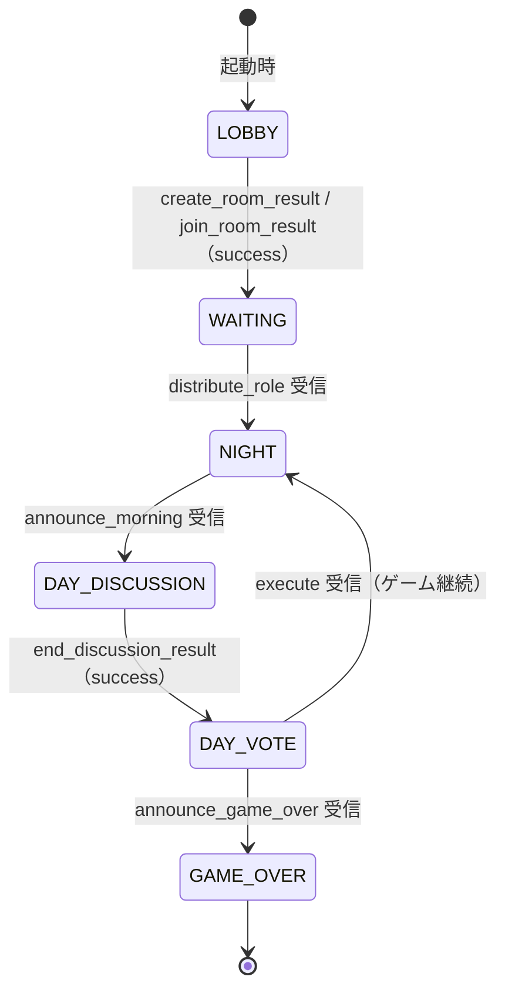
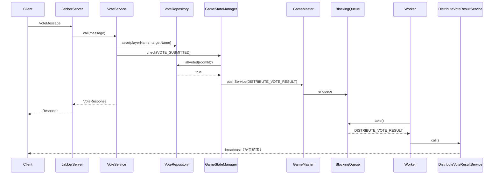
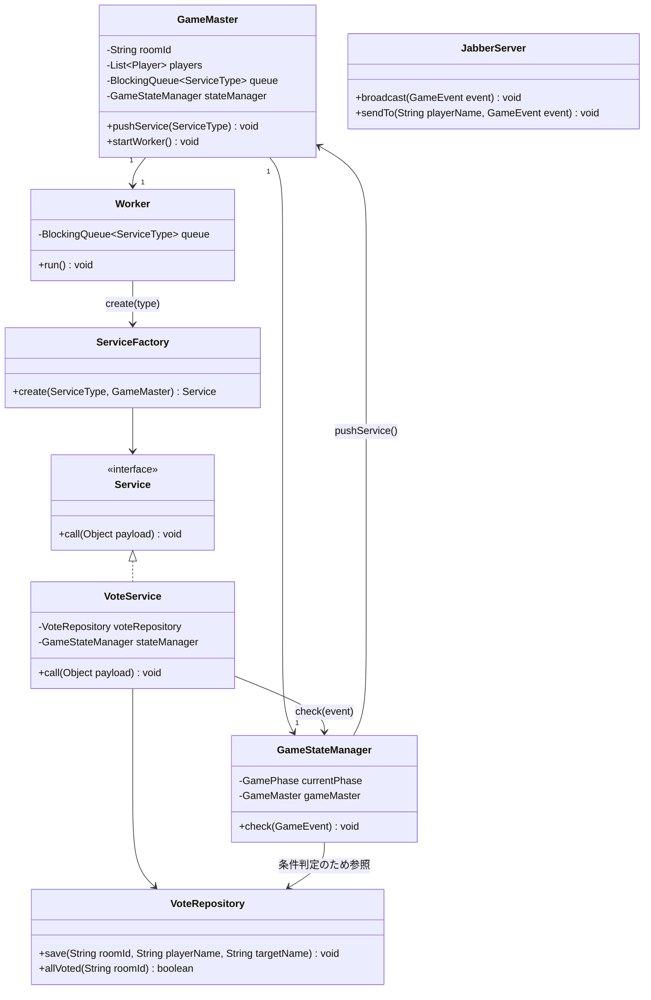
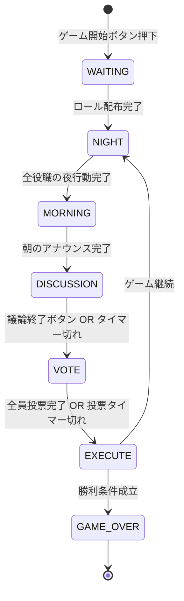

# プロジェクト構成

## client

GUIクライアント側のコードを格納するディレクトリです。

### ディレクトリ構造

```
src/client/
├── GUIClient.java              # エントリーポイント（main）
├── state/
│   ├── GamePhase.java          # enum: LOBBY / WAITING / NIGHT / DAY_DISCUSSION / DAY_VOTE / GAME_OVER
│   ├── GameStateListener.java  # interface: UI通知用 Observer
│   └── GameState.java          # ゲーム状態の単一ソース（myName / myRole / phase / players / chatLog）
├── network/
│   ├── ServerConnection.java   # Socket管理・send(Object) でJSONシリアライズして送信
│   └── MessageReceiver.java    # 受信専用デーモンスレッド → MessageDispatcher へ委譲
├── dispatch/
│   └── MessageDispatcher.java  # message_type → Consumer<JsonNode> のルーティングテーブル
└── ui/
    ├── MainFrame.java          # JFrame + CardLayout（LOBBY / GAME 画面切り替え）
    ├── LobbyPanel.java         # 接続フォーム（ホスト・プレイヤー名・ルームID）
    ├── GamePanel.java          # ゲーム画面の外枠（子パネルへ通知を委譲）
    ├── ChatPanel.java          # チャットログ表示 + 入力欄
    ├── PlayerListPanel.java    # プレイヤー一覧 + 役職・フェーズ表示
    └── ActionPanel.java        # アクションボタン（フェーズ × 役職で動的切り替え）
```

**パッケージ対応表**

| ディレクトリ | パッケージ |
|-------------|-----------|
| `src/client/` | `src.client` |
| `src/client/state/` | `src.client.state` |
| `src/client/network/` | `src.client.network` |
| `src/client/dispatch/` | `src.client.dispatch` |
| `src/client/ui/` | `src.client.ui` |

### アーキテクチャ概要

#### データフロー

```
【送信】 UIボタン操作 → ActionPanel / ChatPanel → ServerConnection.send()

【受信】 MessageReceiver（デーモンスレッド）
          → MessageDispatcher.dispatch(json)
          → GameState 更新
          → GameState.notifyListeners()
          → SwingUtilities.invokeLater() でEDTに切り替え
          → 各 Panel の onStateChanged() が呼ばれて再描画
```

#### クライアント フェーズ遷移



#### ActionPanel のフェーズ × 役職マトリクス

| フェーズ | 全役職共通 | WOLF | SEER | KNIGHT | VILLAGER |
|----------|-----------|------|------|--------|----------|
| WAITING | ゲーム開始ボタン | | | | |
| DAY_DISCUSSION | 議論終了ボタン | | | | |
| DAY_VOTE | 投票先選択 + 投票ボタン | | | | |
| NIGHT | — | 襲撃対象選択 | 占い対象選択 | 守護対象選択 | 待機表示 |
| GAME_OVER | ゲーム終了表示 | | | | |

#### スレッド安全性

受信スレッド（`MessageReceiver`）は Swing の EDT（Event Dispatch Thread）とは別スレッドです。
`GameState.notifyListeners()` 内で `SwingUtilities.invokeLater()` を呼ぶことで、
UI 更新を常に EDT 上で実行します。Swing コンポーネントを受信スレッドから直接触れてはいけません。

```java
// GameState.java
public void notifyListeners() {
    SwingUtilities.invokeLater(() ->
        listeners.forEach(l -> l.onStateChanged(this))
    );
}
```

---

## server

サーバー側のコードを格納するディレクトリです.

### ディレクトリ構造

```
src/server/
├── JabberServer.java          # エントリーポイント（main）・Broadcaster 実装
├── game/                      # ゲームロジック
│   ├── GameMaster.java        # roomId・Queue・Worker の管理
│   ├── GameStateManager.java  # フェーズ保持・イベント条件判定
│   ├── GamePhase.java         # enum: WAITING / NIGHT / MORNING / DISCUSSION / VOTE / EXECUTE / GAME_OVER
│   └── GameEvent.java         # enum: NIGHT_ACTION_SUBMITTED / VOTE_SUBMITTED / DISCUSSION_ENDED
├── core/                      # 通信インフラ・サービス基盤
│   ├── Broadcaster.java       # interface: broadcast / sendTo / broadcastAlive など
│   ├── BroadcastService.java  # interface: Worker が実行するサービスのマーカー
│   ├── ClientRegistry.java    # プレイヤー接続管理・メッセージ配信
│   ├── ServiceFactory.java    # ServiceType → BroadcastService インスタンス生成
│   ├── ServiceType.java       # enum: DISTRIBUTE_ROLE / ANNOUNCE_MORNING / …
│   └── Worker.java            # Queue を監視して BroadcastService を実行するスレッド
├── database/                  # データ層
│   ├── GameDatabase.java      # Singleton: roomId → RoomData マップ
│   ├── RoomData.java          # ゲーム状態コンテナ
│   ├── entity/                # データクラス・enum（Player, Role, ChatMessage）
│   └── repository/            # CRUD のみ（Chat / Room / Player / NightAction / Vote）
└── service/                   # Service 実装（クライアント起点・サーバー起点）
```

**パッケージ対応表**

| ディレクトリ | パッケージ |
|-------------|-----------|
| `src/server/` | `src.server` |
| `src/server/game/` | `src.server.game` |
| `src/server/core/` | `src.server.core` |
| `src/server/database/` | `src.server.database` |
| `src/server/database/entity/` | `src.server.database.entity` |
| `src/server/database/repository/` | `src.server.database.repository` |
| `src/server/service/` | `src.server.service` |

`JabberServer` でクライアントからの接続を受け付け、適切な Service クラスを call します。
各 Service クラスは Request 引数を受け取って Request に応じた処理を行い、Response を返します。

```java
public class CreateRoomService {
    public CreateRoomResultMessage call(CreateRoomMessage message) {
        boolean success = roomRepository.create(message.roomId);
        return new CreateRoomResultMessage(success);
    }
}
```

```java
public class CreateRoomMessage {
    public String roomId;
}
```

```java
public class CreateRoomResultMessage {
    public boolean success;
}
```

---

## ゲームシステム設計

### アーキテクチャ全体図


### 方針

**クライアントリクエスト → 即時 Service 呼び出し**
- `Service.call(message) → ResultMessage` をそのまま使う
- Service 内で Repository を通じてデータを CRUD し、最後に `GameStateManager.check(event)` を呼ぶ

**GameStateManager.check()**
- `currentPhase` と渡された `GameEvent` をもとに、Repository からデータを読んで条件を判定する
- 条件成立なら `GameMaster.pushService(ServiceType.Xxx)` でエンキューのみ行う
- データは自分でキャッシュせず、常に Repository から読む

**サーバー起点イベント → Queue 経由**
- Worker ループが Queue から取り出し、`ServiceFactory` 経由で Service を実行して全クライアントに broadcast する

**二重発火防止（タイマー + 条件の競合）**
- 「全員投票完了 OR 投票タイマー切れ」のような競合には `AtomicBoolean` で対応する

```java
private final AtomicBoolean voteResolved = new AtomicBoolean(false);

if (voteResolved.compareAndSet(false, true)) {
    gameMaster.pushService(ServiceType.DISTRIBUTE_VOTE_RESULT);
}
```

### 主要クラス

| クラス | 責務 |
|--------|------|
| `JabberServer` | クライアント接続の受付・即時 Service の呼び出し・broadcast の実装 |
| `Service`（各実装） | Repository で CRUD → `GameStateManager.check()` → Response を返す |
| `XxxRepository` | データの CRUD のみ。ゲームロジックを持たない |
| `GameStateManager` | `currentPhase` の保持・`check(event)` での条件判定・`pushService()` の呼び出し |
| `GameMaster` | `roomId` / `players` などの設定保持・Queue と Worker の管理・`pushService()` の提供 |
| `Worker`（スレッド） | Queue を監視し、ServiceFactory 経由で Service を実行 |
| `ServiceFactory` | ServiceType → Service インスタンスの生成 |

### シーケンス図（投票フローの例）



### クラス図



### フェーズ遷移図



### フェーズと発火条件

| イベント | 発火条件 | 方式 |
|----------|----------|------|
| 夜フェーズ終了 → 朝へ | 全役職の夜行動完了 | check(NIGHT_ACTION_SUBMITTED) |
| 投票集計 | 全員投票完了 OR 投票タイマー切れ | check(VOTE_SUBMITTED) + AtomicBoolean |
| 議論終了 → 投票へ | ボタン押下 OR 議論タイマー切れ | check(DISCUSSION_ENDED) + AtomicBoolean |
| 処刑 → 勝利判定 | 投票集計完了後 | Queue 連鎖 |
| ゲーム終了 | 勝利条件成立 | Queue 連鎖 |
