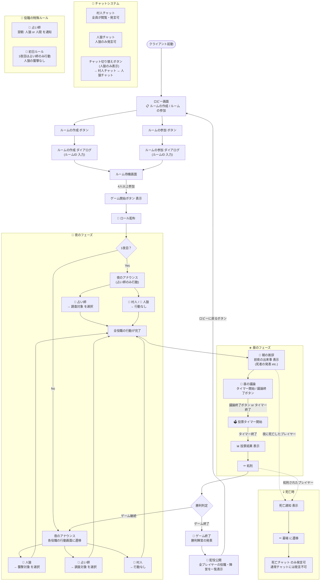

# 人狼ゲーム フロー図

```mermaid
flowchart TD
    START([クライアント起動]) --> LOBBY["ロビー画面
    📋 ルームの作成 / ルームの参加"]

    LOBBY --> CREATE_BTN[ルームの作成 ボタン]
    LOBBY --> JOIN_BTN[ルームの参加 ボタン]

    CREATE_BTN --> CREATE_DLG["ルームの作成 ダイアログ
    (ルームID 入力)"]
    JOIN_BTN --> JOIN_DLG["ルームの参加 ダイアログ
    (ルームID 入力)"]

    CREATE_DLG --> WAITING[ルーム待機画面]
    JOIN_DLG --> WAITING

    WAITING -->|4人以上参加| GAME_START[ゲーム開始ボタン 表示]
    GAME_START --> ROLE_DIST[🎴 ロール配布]

    ROLE_DIST --> NIGHT_CHECK

    %% ====== 夜のフェーズ ======
    subgraph NIGHT_PHASE["🌙 夜のフェーズ"]
        NIGHT_CHECK{1夜目？} -->|Yes| NIGHT_START_1["夜のアナウンス
        (占い師のみ行動)"]
        NIGHT_CHECK -->|No| NIGHT_START_N["夜のアナウンス
        各役職の行動画面に遷移"]

        NIGHT_START_1 --> SEER_ACT_1["🔮 占い師
        → 調査対象 を選択"]
        NIGHT_START_1 --> VILLAGE_WAIT_1["👤 村人 / 🐺 人狼
        → 行動なし"]

        NIGHT_START_N --> WOLF_ACT["🐺 人狼
        → 襲撃対象 を選択"]
        NIGHT_START_N --> SEER_ACT["🔮 占い師
        → 調査対象 を選択"]
        NIGHT_START_N --> VILLAGE_WAIT["👤 村人
        → 行動なし"]

        SEER_ACT_1 & VILLAGE_WAIT_1 --> ALL_DONE[全役職の行動が完了]
        WOLF_ACT & SEER_ACT & VILLAGE_WAIT --> ALL_DONE
    end

    %% ====== 朝・昼のフェーズ ======
    ALL_DONE --> MORNING

    subgraph DAY_PHASE["☀️ 昼のフェーズ"]
        MORNING["🌅 朝の挨拶
        前夜の出来事 表示
        (死者の発表 etc.)"] --> DISCUSSION["💬 昼の議論
        タイマー開始 / 議論終了ボタン"]
        DISCUSSION -->|"議論終了ボタン or タイマー終了"| VOTE["🗳️ 投票タイマー開始"]
        VOTE -->|タイマー終了| VOTE_RESULT["📊 投票結果 表示"]
        VOTE_RESULT --> EXECUTE["⚰️ 処刑"]
    end

    EXECUTE --> WIN_CHECK{勝利判定}
    WIN_CHECK -->|ゲーム継続| NIGHT_START_N
    WIN_CHECK -->|ゲーム終了| GAME_OVER["🏁 ゲーム終了
    勝利陣営の発表"]

    GAME_OVER --> ROLE_REVEAL["🎴 配役公開
    全プレイヤーの役職・陣営を一覧表示"]
    ROLE_REVEAL -->|"ロビーに戻るボタン"| LOBBY

    %% ====== 死亡フロー ======
    subgraph DEATH_FLOW["💀 死亡時"]
        DEAD["死亡通知 表示"] --> GRAVEYARD["⚰️ 墓場 に遷移"]
        GRAVEYARD --> DEAD_CHAT["死亡チャット のみ発言可
        通常チャットには発言不可"]
    end

    MORNING -.->|夜に死亡したプレイヤー| DEAD
    EXECUTE -.->|処刑されたプレイヤー| DEAD

    %% ====== チャットシステム ======
    subgraph CHAT_SYS["💬 チャットシステム"]
        V_CHAT[村人チャット\n全員が閲覧・発言可]
        W_CHAT["人狼チャット
        人狼のみ発言可"]
        TOGGLE["チャット切り替えボタン
        (人狼のみ表示)
        → 村人チャット ↔ 人狼チャット"]
    end

    %% ====== 役職の特殊ルール ======
    subgraph ROLE_RULES["📜 役職の特殊ルール"]
        SEER_RULE["🔮 占い師
        翌朝: 人狼 or 人間 を通知"]
        NIGHT1_RULE["🌙 初日ルール
        1夜目は占い師のみ行動
        人狼の襲撃なし"]
    end
```
