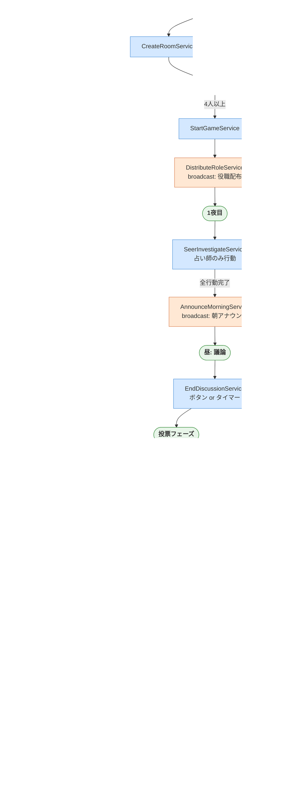
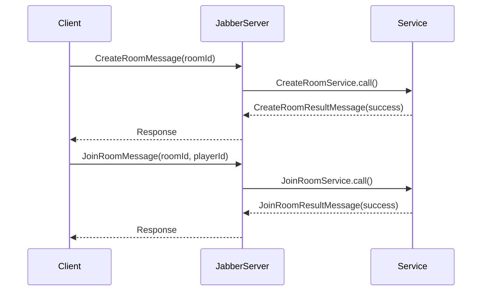
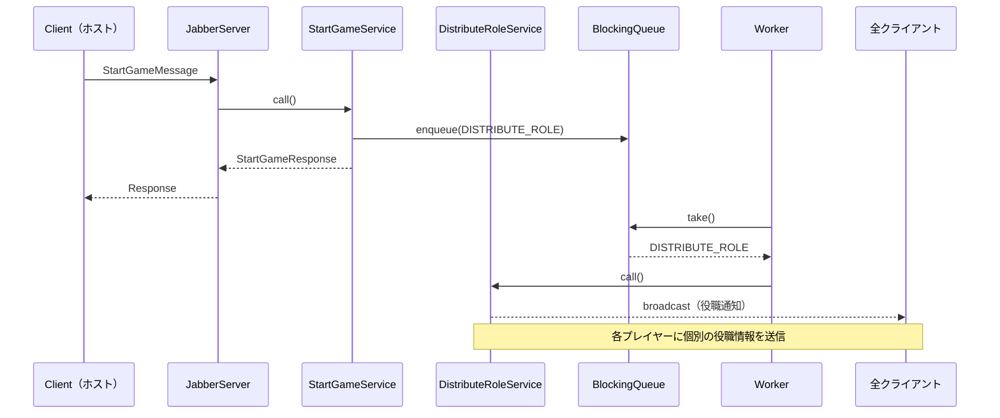
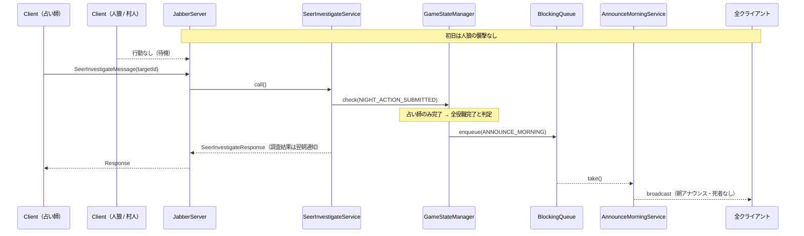
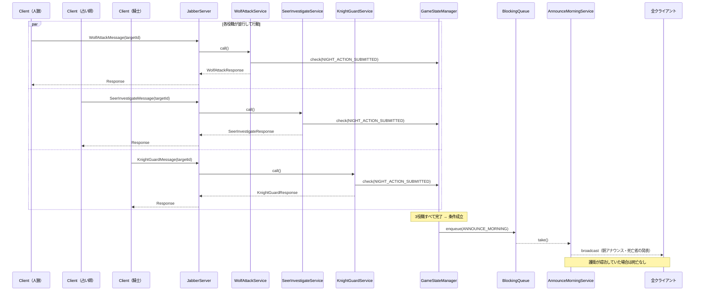
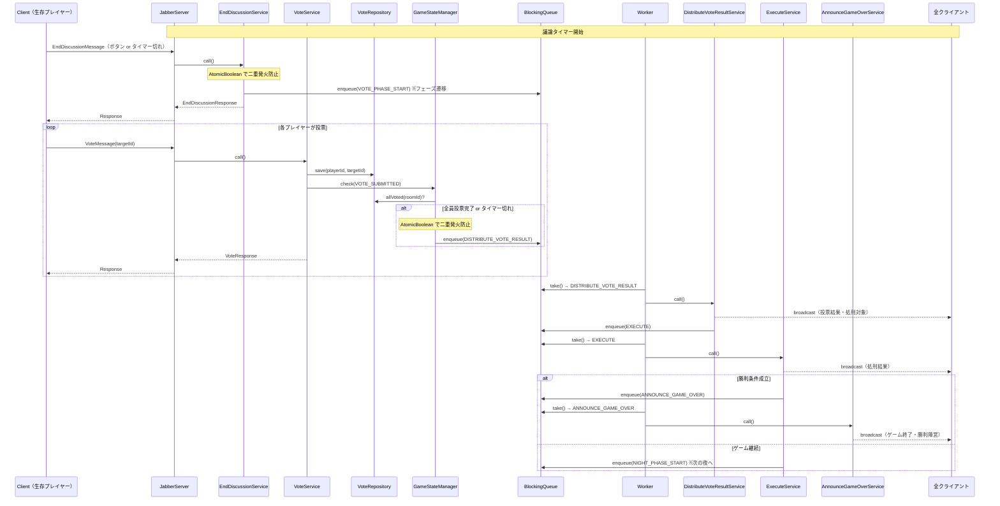
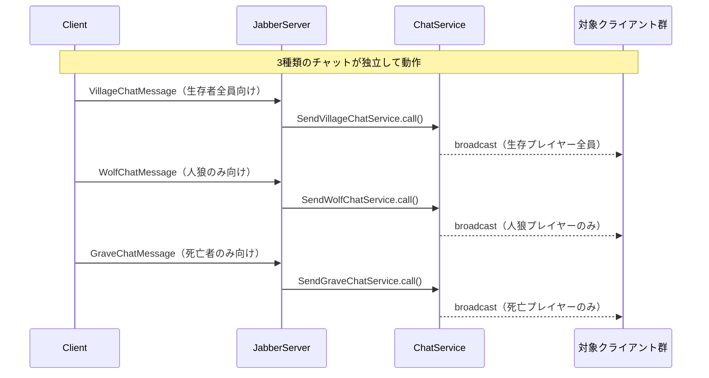
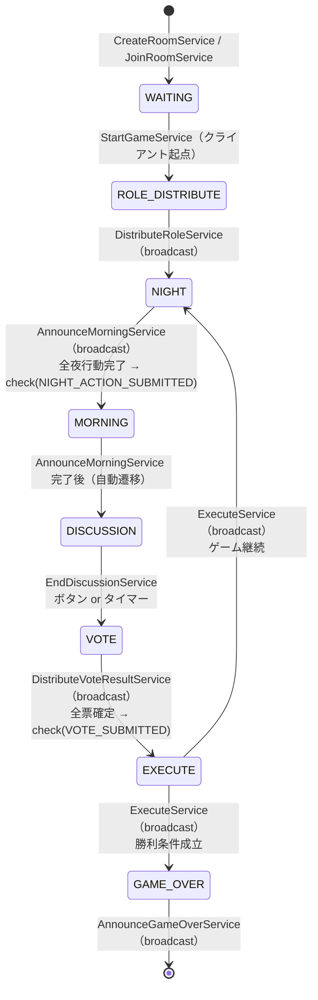

# ゲームフロー ─ Service 呼び出しタイミング一覧

## 1. Service 呼び出しパターン

| 種別 | 説明 | 戻り値 |
|------|------|--------|
| **クライアント起点** | クライアントの Request を受けて即時実行 | Response を送信元に返す |
| **サーバー起点 (broadcast)** | Worker が Queue から取り出して実行 | 全クライアントへ broadcast |

---

## 2. 全 Service 一覧

| Service | 起点 | 発火タイミング |
|---------|------|----------------|
| `CreateRoomService` | クライアント | ルーム作成ボタン押下 |
| `JoinRoomService` | クライアント | ルーム参加ボタン押下 |
| `DeleteRoomService` | クライアント | ルーム削除時 |
| `StartGameService` | クライアント | ゲーム開始ボタン押下 |
| `DistributeRoleService` | **サーバー (broadcast)** | StartGameService 完了後 → Queue |
| `WolfAttackService` | クライアント（人狼のみ） | 夜フェーズに人狼が襲撃対象を選択 |
| `SeerInvestigateService` | クライアント（占い師のみ） | 夜フェーズに占い師が調査対象を選択 |
| `KnightGuardService` | クライアント（騎士のみ） | 夜フェーズに騎士が護衛対象を選択 |
| `AnnounceMorningService` | **サーバー (broadcast)** | 全役職の夜行動完了 → `check(NIGHT_ACTION_SUBMITTED)` → Queue |
| `EndDiscussionService` | クライアント or タイマー | 議論終了ボタン押下 / 議論タイマー切れ |
| `VoteService` | クライアント | 投票フェーズに各プレイヤーが投票 |
| `DistributeVoteResultService` | **サーバー (broadcast)** | 全員投票完了 or 投票タイマー切れ → `check(VOTE_SUBMITTED)` → Queue |
| `ExecuteService` | **サーバー (broadcast)** | DistributeVoteResultService 完了後 → Queue 連鎖 |
| `AnnounceGameOverService` | **サーバー (broadcast)** | ExecuteService で勝利条件成立 → Queue 連鎖 |
| `SendVillageChatService` | クライアント | 昼フェーズに生存プレイヤーがチャット送信 |
| `SendWolfChatService` | クライアント | 夜フェーズに人狼がチャット送信 |
| `SendGraveChatService` | クライアント | 死亡プレイヤーが墓場チャット送信 |

---

## 3. ゲーム全体フロー

---

## 4. 各フェーズの詳細シーケンス

### 4-1. ルーム管理

---

### 4-2. ゲーム開始 → 役職配布

---

### 4-3. 夜フェーズ（初日 ─ 占い師のみ行動）

---

### 4-4. 夜フェーズ（2日目以降 ─ 全役職行動）

---

### 4-5. 昼フェーズ ─ 議論 → 投票 → 処刑

---

### 4-6. チャットサービス（随時呼び出し）

---

## 5. GameStateManager.check() イベント一覧

| GameEvent | チェック条件 | 成立時に Queue に積む ServiceType |
|-----------|------------|----------------------------------|
| `NIGHT_ACTION_SUBMITTED` | 当該夜に必要な全役職の行動が完了した | `ANNOUNCE_MORNING` |
| `VOTE_SUBMITTED` | 全員投票完了 **または** 投票タイマー切れ | `DISTRIBUTE_VOTE_RESULT` |
| `DISCUSSION_ENDED` | 議論終了ボタン押下 **または** 議論タイマー切れ | （投票フェーズ開始） |

> **二重発火防止**: `AtomicBoolean.compareAndSet(false, true)` により、タイマーとボタン押下が競合しても Queue へは1度だけ積まれますね。

---

## 6. フェーズ遷移 と 発火する Service の対応

