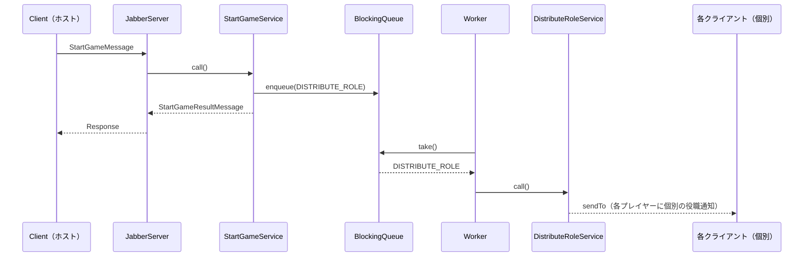

# ゲーム開始・役職配布

ホストがゲームを開始し、各プレイヤーに役職をランダムに配布するフェーズ。

---

## 関連クラス

| クラス | 役割 |
|--------|------|
| `StartGameService` | ゲーム開始の受付・`DISTRIBUTE_ROLE` をキューに積む |
| `DistributeRoleService` | 役職をシャッフルして各プレイヤーに個別通知（broadcast） |
| `PlayerRepository` | プレイヤーの役職の保存・取得 |

---

## StartGameService

**起点**: クライアント（ゲーム開始ボタン押下）

```
Client → JabberServer → StartGameService → Queue[DISTRIBUTE_ROLE]
                                         ↓
                              StartGameResultMessage
```

### 処理フロー

1. 人数チェック（4人以上）
2. `GameMaster.pushService(ServiceType.DISTRIBUTE_ROLE)` でキューに積む
3. `StartGameResultMessage(success)` をクライアントに返す

### メッセージ

| メッセージ | フィールド |
|-----------|-----------|
| `StartGameMessage` | `roomId` |
| `StartGameResultMessage` | `success` |

---

## DistributeRoleService

**起点**: サーバー（Worker が Queue から取り出して実行）

```
Worker → DistributeRoleService → 各クライアントに個別 sendTo
```

### 処理フロー

1. プレイヤー一覧を取得
2. 役職リスト（`WOLF`, `SEER`, `KNIGHT`, `VILLAGER`×2）をシャッフル
3. 各プレイヤーに `PlayerRepository.assignRole()` で役職を保存
4. `broadcaster.sendTo(playerName, DistributeRoleMessage)` で**個別に**通知
5. フェーズを `NIGHT` に遷移、`nightCount` を 1 に初期化

### メッセージ

| メッセージ | フィールド |
|-----------|-----------|
| `DistributeRoleMessage` | `role` |

> 役職は全員に broadcast するのではなく、`sendTo()` で個人宛に送る（他プレイヤーに役職が漏れない）

---

## シーケンス図



---

## 実装上の注意

- `DistributeRoleService` は `BroadcastService` を実装するが、送信は `broadcaster.broadcast()` ではなく `broadcaster.sendTo()` を使う
- 役職配布後に `nightCount = 1`（初日）を設定し、`GameStateManager.isFirstNight()` で初日判定ができるようにする
