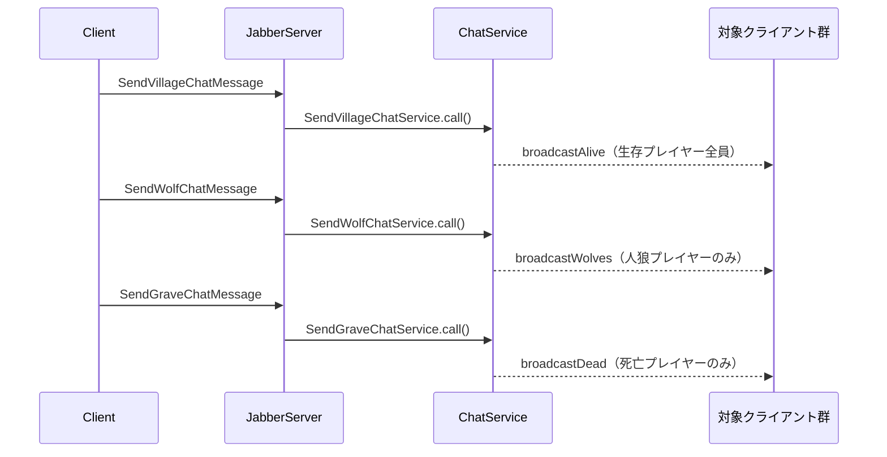

# チャット

3種類のチャットチャンネルが独立して動作する。送信先（受信できるプレイヤー）がチャンネルごとに異なる。

---

## 関連クラス

| クラス | 役割 |
|--------|------|
| `SendVillageChatService` | 生存プレイヤー全員向けチャット |
| `SendWolfChatService` | 人狼プレイヤーのみ向けチャット（夜フェーズ） |
| `SendGraveChatService` | 死亡プレイヤーのみ向けチャット |
| `ChatRepository` | チャットメッセージの保存 |
| `PlayerRepository` | 送信者名の取得・送信先の絞り込み |
| `Broadcaster` | 送信先を指定したメッセージ配信 |

---

## チャンネルの種類と送信先

| チャンネル | 送信できるプレイヤー | 受信できるプレイヤー |
|-----------|-------------------|-------------------|
| 全体チャット（VILLAGE） | 生存プレイヤー | 生存プレイヤー全員 |
| 人狼チャット（WOLF） | 人狼（夜フェーズ） | 人狼プレイヤーのみ |
| 墓場チャット（GRAVE） | 死亡プレイヤー | 死亡プレイヤーのみ |

---

## SendVillageChatService

**起点**: クライアント（昼フェーズ、生存プレイヤー）

```
Client → SendVillageChatService → ChatRepository.addVillageMessage()
                                → broadcaster.broadcastAlive()
```

### 処理フロー

1. `msg.senderName` をそのまま使用
2. `ChatRepository.addVillageMessage()` でメッセージを保存
3. `broadcaster.broadcastAlive()` で生存プレイヤーに配信

### メッセージ

| メッセージ | フィールド |
|-----------|-----------|
| `SendVillageChatMessage` | `roomId`, `senderName`, `text` |
| `SendChatResultMessage` | `success` |
| `ChatBroadcastMessage` | `channel("VILLAGE")`, `senderName`, `text` |

---

## SendWolfChatService

**起点**: クライアント（夜フェーズ、人狼プレイヤー）

```
Client（人狼） → SendWolfChatService → ChatRepository.addWolfMessage()
                                     → broadcaster.broadcastWolves()
```

### メッセージ

| メッセージ | フィールド |
|-----------|-----------|
| `SendWolfChatMessage` | `roomId`, `senderName`, `text` |
| `SendChatResultMessage` | `success` |
| `ChatBroadcastMessage` | `channel("WOLF")`, `senderName`, `text` |

---

## SendGraveChatService

**起点**: クライアント（死亡プレイヤー）

```
Client（死亡） → SendGraveChatService → ChatRepository.addGraveMessage()
                                      → broadcaster.broadcastDead()
```

### メッセージ

| メッセージ | フィールド |
|-----------|-----------|
| `SendGraveChatMessage` | `roomId`, `senderName`, `text` |
| `SendChatResultMessage` | `success` |
| `ChatBroadcastMessage` | `channel("GRAVE")`, `senderName`, `text` |

---

## シーケンス図



---

## Broadcaster の配信メソッド

| メソッド | 配信対象 |
|---------|---------|
| `broadcast(roomId, msg)` | ルーム内の全クライアント |
| `broadcastAlive(roomId, msg)` | 生存プレイヤーのみ |
| `broadcastWolves(roomId, msg)` | 人狼ロールのプレイヤーのみ |
| `broadcastDead(roomId, msg)` | 死亡プレイヤーのみ |
| `sendTo(playerName, msg)` | 特定の1クライアントのみ |

---

## 実装上の注意

- チャットサービスはフェーズに依存しないが、フェーズチェックは JabberServer や クライアント側で行うことを想定している
- 送信者名は `msg.senderName` をそのまま使用する（名前が識別子を兼ねるため）
- `ChatBroadcastMessage` は channel フィールドで3種類を区別できるため、クライアント側で表示を切り替えやすい
