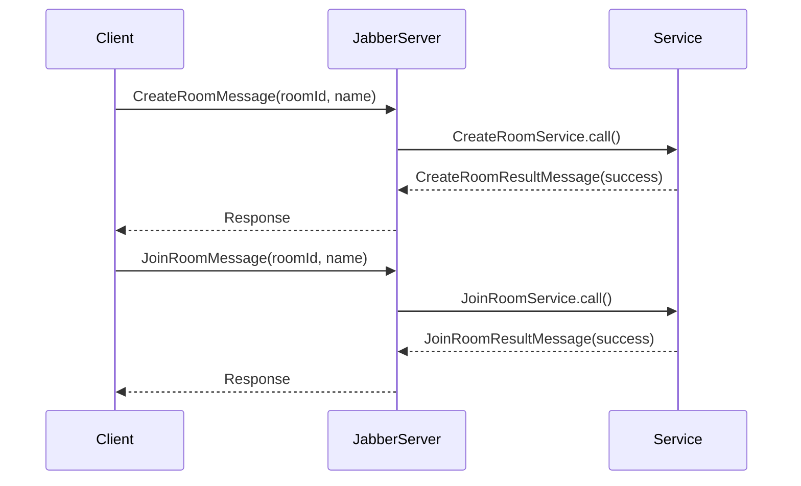

# ルーム管理

ゲーム開始前のロビー操作。ルームの作成・参加・削除を担う。

---

## 関連クラス

| クラス | 役割 |
|--------|------|
| `CreateRoomService` | ルーム作成、作成者をプレイヤーとして登録 |
| `JoinRoomService` | 既存ルームへの参加 |
| `DeleteRoomService` | ルームの削除 |
| `RoomRepository` | ルーム・プレイヤーの CRUD |

---

## CreateRoomService

**起点**: クライアント（ルーム作成ボタン押下）

```
Client → JabberServer → CreateRoomService → RoomRepository
                                          ↓
                                 CreateRoomResultMessage
```

### 処理フロー

1. `RoomRepository.create(roomId)` でルームを作成
2. 作成済み ID なら `success=false` を返す
3. 作成者を `Player` として `addPlayer()` で登録
4. `GameStateManager.setPhase(WAITING)` でフェーズを初期化
5. `CreateRoomResultMessage(success, message)` をクライアントに返す

### メッセージ

| メッセージ | フィールド |
|-----------|-----------|
| `CreateRoomMessage` | `roomId`, `name` |
| `CreateRoomResultMessage` | `success`, `message` |

---

## JoinRoomService

**起点**: クライアント（ルーム参加ボタン押下）

### 処理フロー

1. `RoomRepository.exists(roomId)` でルーム存在確認
2. `addPlayer()` でプレイヤーを追加
3. `JoinRoomResultMessage(success)` を返す

### メッセージ

| メッセージ | フィールド |
|-----------|-----------|
| `JoinRoomMessage` | `roomId`, `name` |
| `JoinRoomResultMessage` | `success` |

---

## DeleteRoomService

**起点**: クライアント（ルーム削除時）

### 処理フロー

1. `RoomRepository.delete(roomId)` でルームを削除
2. `DeleteRoomResultMessage(success)` を返す

### メッセージ

| メッセージ | フィールド |
|-----------|-----------|
| `DeleteRoomMessage` | `roomId` |
| `DeleteRoomResultMessage` | `success` |

---

## シーケンス図



---

## 実装上の注意

- ルーム ID の重複チェックは `RoomRepository.create()` の返り値（`boolean`）で判定する
- フェーズ初期化（`WAITING`）は `CreateRoomService` のみが行う
