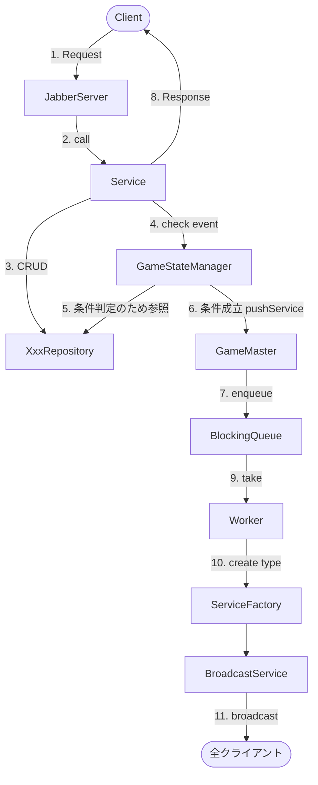
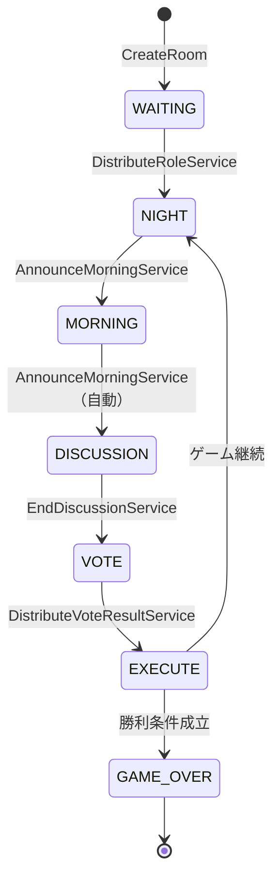

# 基盤・アーキテクチャ

ゲーム全体を支えるサーバーの基盤実装。Service の呼び出し・状態管理・非同期配信の仕組みを担う。

---

## アーキテクチャ全体図



---

## 主要クラスの責務

| クラス | 責務 |
|--------|------|
| `JabberServer` | クライアント接続の受付・即時 Service の呼び出し・`Broadcaster` の実装 |
| `Service`（各実装） | Repository で CRUD → `GameStateManager.check()` → Response を返す |
| `XxxRepository` | データの CRUD のみ。ゲームロジックを持たない |
| `GameStateManager` | `currentPhase` の保持・`check(event)` での条件判定・`pushService()` の呼び出し |
| `GameMaster` | `roomId` / `players` などの設定保持・Queue と Worker の管理・`pushService()` の提供 |
| `Worker`（スレッド） | Queue を監視し、`ServiceFactory` 経由で Service を実行 |
| `ServiceFactory` | `ServiceType` → `Service` インスタンスの生成 |
| `BroadcastService` | サーバー起点の broadcast Service が実装するインターフェース |

---

## JabberServer

`JabberServer` はクライアントの TCP 接続を受け付け、受信した JSON を適切な Service へルーティングする。また `Broadcaster` インターフェースを実装し、各 Service から broadcast / sendTo を呼べるようにする。

```
クライアントごとに Worker スレッドを立ち上げ
→ 受信 JSON をデシリアライズ
→ ServiceFactory でサービスを解決して call()
→ 結果を JSON シリアライズしてレスポンス
```

---

## GameStateManager

`check(GameEvent)` を受け取り、現在フェーズと Repository のデータをもとに次のアクションを決定する。

```java
public void check(GameEvent event) {
    switch (event) {
        case NIGHT_ACTION_SUBMITTED -> {
            if (gameMaster.allNightActionsComplete()) {
                gameMaster.pushService(ServiceType.ANNOUNCE_MORNING);
            }
        }
        case VOTE_SUBMITTED -> {
            if (gameMaster.allVoted()) {
                if (voteResolved.compareAndSet(false, true)) {
                    gameMaster.pushService(ServiceType.DISTRIBUTE_VOTE_RESULT);
                }
            }
        }
        case DISCUSSION_ENDED -> {
            if (discussionEnded.compareAndSet(false, true)) {
                currentPhase = GamePhase.VOTE;
            }
        }
    }
}
```

- データは自身でキャッシュせず、常に Repository から読む
- `AtomicBoolean` でタイマーとクライアント操作の競合を防ぐ

---

## GameMaster

ルームごとに1インスタンス生成。`BlockingQueue` と `Worker` スレッドを管理する。

```java
public void pushService(ServiceType type) {
    queue.offer(type);
}

public void startWorker(Broadcaster broadcaster) {
    Thread workerThread = new Thread(new Worker(queue, this, broadcaster));
    workerThread.setDaemon(true);
    workerThread.start();
}
```

- `pushService()` はどこからでも呼べる（`GameStateManager` や各 Service から）
- Worker スレッドはデーモンスレッドとして動作する

---

## Worker

`BlockingQueue` を `take()` でブロック待機し、`ServiceFactory` 経由で `BroadcastService` を取得して実行する。

```
while (true) {
    ServiceType type = queue.take();   // ブロック待機
    BroadcastService svc = ServiceFactory.create(type, gameMaster, broadcaster);
    svc.call();
}
```

---

## ServiceFactory

`ServiceType` に応じた `BroadcastService` インスタンスを生成して返す。

```java
switch (type) {
    case DISTRIBUTE_ROLE     -> new DistributeRoleService(roomId, gameMaster, broadcaster);
    case ANNOUNCE_MORNING    -> new AnnounceMorningService(roomId, gameMaster, broadcaster);
    case DISTRIBUTE_VOTE_RESULT -> new DistributeVoteResultService(roomId, gameMaster, broadcaster);
    case EXECUTE             -> new ExecuteService(roomId, gameMaster, broadcaster);
    case ANNOUNCE_GAME_OVER  -> new AnnounceGameOverService(roomId, gameMaster, broadcaster);
    ...
}
```

---

## GamePhase（フェーズ一覧）



| フェーズ | 説明 |
|---------|------|
| `WAITING` | プレイヤーの参加待ち |
| `NIGHT` | 夜の役職行動フェーズ |
| `MORNING` | 朝のアナウンス処理中 |
| `DISCUSSION` | 昼の議論フェーズ |
| `VOTE` | 投票フェーズ |
| `GAME_OVER` | ゲーム終了 |

---

## GameEvent（イベント一覧）

| イベント | 発火元 | `check()` の効果 |
|---------|--------|----------------|
| `NIGHT_ACTION_SUBMITTED` | `WolfAttackService` / `SeerInvestigateService` / `KnightGuardService` | 全夜行動完了で `ANNOUNCE_MORNING` をキューに積む |
| `VOTE_SUBMITTED` | `VoteService` | 全投票完了で `DISTRIBUTE_VOTE_RESULT` をキューに積む |
| `DISCUSSION_ENDED` | `EndDiscussionService` | フェーズを `VOTE` に遷移 |

---

## Service の2種類

| 種別 | インターフェース | 戻り値 | 例 |
|------|---------------|--------|-----|
| クライアント起点 | なし（直接 `call(Message)` を定義） | `ResultMessage` | `VoteService`, `CreateRoomService` |
| サーバー起点 | `BroadcastService` | なし（内部で broadcast） | `ExecuteService`, `AnnounceMorningService` |

---

## 実装上の注意

- `GameMaster` はルームごとに1インスタンスで、`JabberServer` がルーム ID をキーに管理する
- Worker スレッドはデーモンスレッドなので、JVM 終了時に自動的に終了する
- キューへの積み忘れは Service チェーンの停止を引き起こすため、各 broadcast Service の末尾で次の `ServiceType` をキューに積むこと
