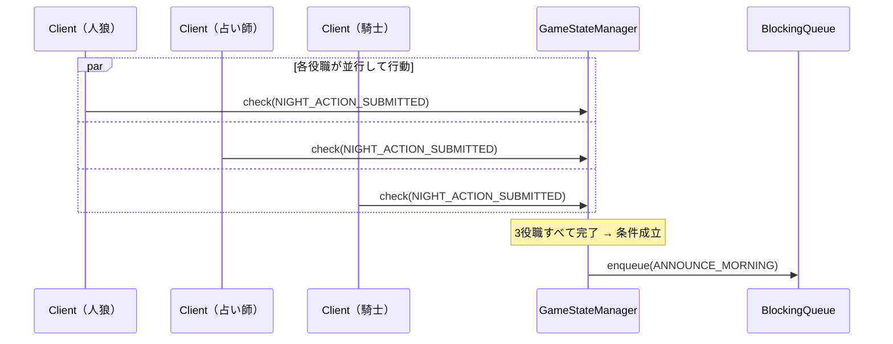

# 夜フェーズ（役職行動）

夜フェーズでは各役職がそれぞれの行動を行う。全役職の行動が揃い次第、朝へ自動遷移する。

---

## 関連クラス

| クラス | 役割 |
|--------|------|
| `WolfAttackService` | 人狼が襲撃対象を選択 |
| `SeerInvestigateService` | 占い師が調査対象を選択 |
| `KnightGuardService` | 騎士が護衛対象を選択 |
| `NightActionRepository` | 夜行動（襲撃・調査・護衛）の保存・集計 |
| `GameStateManager` | `NIGHT_ACTION_SUBMITTED` イベントで全行動完了を判定 |

---

## WolfAttackService

**起点**: クライアント（人狼のみ、夜フェーズ）

```
Client（人狼） → WolfAttackService → NightActionRepository.saveWolfAttack()
                                   → GameStateManager.check(NIGHT_ACTION_SUBMITTED)
```

### メッセージ

| メッセージ | フィールド |
|-----------|-----------|
| `WolfAttackMessage` | `roomId`, `wolfName`, `targetName` |
| `WolfAttackResultMessage` | `success` |

---

## SeerInvestigateService

**起点**: クライアント（占い師のみ、夜フェーズ）

```
Client（占い師） → SeerInvestigateService → NightActionRepository.saveSeerTarget()
                                          → GameStateManager.check(NIGHT_ACTION_SUBMITTED)
```

> 調査結果は翌朝（`AnnounceMorningService`）に占い師だけへ `sendTo()` で通知される

### メッセージ

| メッセージ | フィールド |
|-----------|-----------|
| `SeerInvestigateMessage` | `roomId`, `seerName`, `targetName` |
| `SeerInvestigateResultMessage` | `success` |

---

## KnightGuardService

**起点**: クライアント（騎士のみ、夜フェーズ）

```
Client（騎士） → KnightGuardService → NightActionRepository.saveKnightTarget()
                                    → GameStateManager.check(NIGHT_ACTION_SUBMITTED)
```

### メッセージ

| メッセージ | フィールド |
|-----------|-----------|
| `KnightGuardMessage` | `roomId`, `knightName`, `targetName` |
| `KnightGuardResultMessage` | `success` |

---

## 全行動完了の判定（GameStateManager / GameMaster）

`check(NIGHT_ACTION_SUBMITTED)` が呼ばれるたびに `GameMaster.allNightActionsComplete()` で全役職の完了を確認する。

```java
// GameMaster.allNightActionsComplete()
if (stateManager.isFirstNight()) {
    // 初日は占い師のみ行動
    return nightActionRepo.getSeerTarget(roomId).isPresent();
}
// 2日目以降：生存している各役職が全員行動済みか確認
if (hasWolf   && !nightActionRepo.allWolvesAttacked(roomId))       return false;
if (hasSeer   && nightActionRepo.getSeerTarget(roomId).isEmpty())   return false;
if (hasKnight && nightActionRepo.getKnightTarget(roomId).isEmpty()) return false;
return true;
```

条件成立時に `pushService(ANNOUNCE_MORNING)` でキューに積み、朝へ遷移する。

---

## フェーズ別の行動必要ロール

| 夜 | 人狼 | 占い師 | 騎士 |
|----|------|--------|------|
| 初日（1夜目） | 行動なし | 調査あり | 行動なし |
| 2日目以降 | 襲撃あり（生存時） | 調査あり（生存時） | 護衛あり（生存時） |

---

## シーケンス図（2日目以降）



---

## 実装上の注意

- 役職が死亡して生存していない場合は、その役職の行動は不要（`allNightActionsComplete()` 内の `hasWolf` 等のフラグで制御）
- 護衛と襲撃の照合は `AnnounceMorningService` 側で行う（夜行動サービスは保存のみ）
- 夜行動のデータは `AnnounceMorningService.call()` の最後に `NightActionRepository.reset()` でリセットされる
