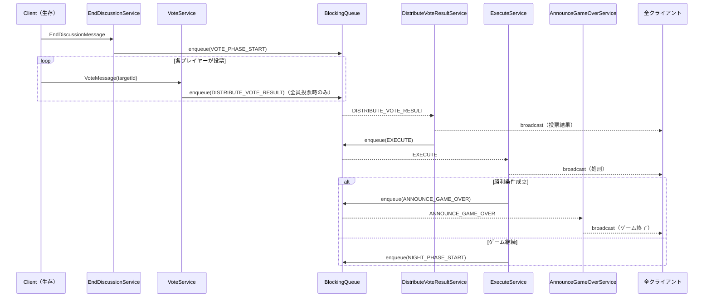

# 昼フェーズ（議論・投票・処刑）

昼フェーズは「議論 → 投票 → 処刑 → 勝利判定」という連鎖で構成される。各ステップはキューを介して連鎖的に実行される。

---

## 関連クラス

| クラス | 役割 |
|--------|------|
| `EndDiscussionService` | 議論終了の受付（ボタン or タイマー） |
| `VoteService` | 投票の受付・保存 |
| `DistributeVoteResultService` | 投票結果の集計・broadcast |
| `ExecuteService` | 処刑・勝利判定 |
| `AnnounceGameOverService` | ゲーム終了通知 |
| `VoteRepository` | 投票データの保存・集計・リセット |
| `PlayerRepository` | 処刑による死亡処理・勝利条件判定 |

---

## EndDiscussionService

**起点**: クライアント（議論終了ボタン押下）またはサーバー（議論タイマー切れ）

```
Client or Timer → EndDiscussionService → Queue[VOTE_PHASE_START]
```

### 処理フロー

1. `GameStateManager.check(DISCUSSION_ENDED)` を呼ぶ
2. `check()` 内で `discussionEnded.compareAndSet(false, true)` により1度だけ処理
3. フェーズを `VOTE` に遷移
4. `pushService(VOTE_PHASE_START)` でキューに積む

### 二重発火防止

```java
// GameStateManager.check(DISCUSSION_ENDED)
if (discussionEnded.compareAndSet(false, true)) {
    currentPhase = GamePhase.VOTE;
}
```

ボタン押下とタイマーが同時に発火しても、`compareAndSet` で一方のみが処理される。

---

## VoteService

**起点**: クライアント（各プレイヤーが投票）

```
Client → VoteService → VoteRepository.save()
                     → GameStateManager.check(VOTE_SUBMITTED)
```

### 処理フロー

1. `VoteRepository.save(roomId, playerName, targetName)` で投票を保存
2. `GameStateManager.check(VOTE_SUBMITTED)` を呼ぶ
3. `check()` 内で `allVoted()` が `true` かつ `voteResolved.compareAndSet(false, true)` 成立で `DISTRIBUTE_VOTE_RESULT` をキューに積む

### メッセージ

| メッセージ | フィールド |
|-----------|-----------|
| `VoteMessage` | `roomId`, `playerName`, `targetName` |
| `VoteResultMessage` | `success` |

---

## DistributeVoteResultService

**起点**: サーバー（Worker が Queue から取り出して実行）

```
Worker → DistributeVoteResultService → broadcast（投票結果）
                                     → Queue[EXECUTE]
```

### 処理フロー

1. `VoteRepository.resolveTarget()` で最多得票者を決定
2. `broadcaster.broadcast()` で全員に投票結果を通知
3. `pushService(EXECUTE)` で処刑をキューに積む

### メッセージ

| メッセージ | フィールド |
|-----------|-----------|
| `DistributeVoteResultMessage` | `targetName`, `voteCounts` |

---

## ExecuteService

**起点**: サーバー（Worker が Queue から取り出して実行）

```
Worker → ExecuteService → PlayerRepository.kill()
                        → broadcast（処刑結果）
                        → Queue[ANNOUNCE_GAME_OVER] or [NIGHT_PHASE_START]
```

### 処理フロー

1. `VoteRepository.resolveTarget()` で処刑対象を取得
2. `PlayerRepository.kill()` で死亡処理
3. `broadcaster.broadcast(ExecuteMessage)` で全員に通知
4. `VoteRepository.reset()` でリセット
5. 勝利判定：
   - `playerRepo.villagersWin()` または `playerRepo.wolvesWin()` が `true` → `ANNOUNCE_GAME_OVER` をキューに積む
   - それ以外 → `NIGHT_PHASE_START` をキューに積み、夜へ遷移

### 勝利条件

| 陣営 | 勝利条件 |
|------|---------|
| 村人陣営 | 人狼が全員死亡 |
| 人狼陣営 | 人狼の数 ≥ 生存する村人の数 |

### メッセージ

| メッセージ | フィールド |
|-----------|-----------|
| `ExecuteMessage` | `executedPlayerName`, `executedRole` |

---

## AnnounceGameOverService

**起点**: サーバー（`ExecuteService` から Queue 経由）

```
Worker → AnnounceGameOverService → broadcast（ゲーム終了）
```

### メッセージ

| メッセージ | フィールド |
|-----------|-----------|
| `AnnounceGameOverMessage` | `winnerSide`, `playerResults[]` |

---

## 昼フェーズ全体のシーケンス



---

## 実装上の注意

- `voteResolved` と `discussionEnded` の `AtomicBoolean` は毎ラウンド `AnnounceMorningService.resetRoundState()` でリセットされる
- `ExecuteService` は `DistributeVoteResultService` と分離されている — 投票結果の表示と処刑アニメーションをクライアント側で分けるための設計
- タイマー切れによる投票集計も `check(VOTE_SUBMITTED)` 経由で同じパスを通る
