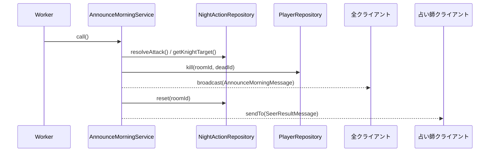

# 朝のアナウンス

夜行動の結果を全プレイヤーに通知する。護衛と襲撃の照合・死亡処理・占い結果の個別通知を担う。

---

## 関連クラス

| クラス | 役割 |
|--------|------|
| `AnnounceMorningService` | 死亡判定・broadcast・占い師への個別通知 |
| `NightActionRepository` | 夜行動（襲撃・護衛・占い対象）の取得とリセット |
| `PlayerRepository` | プレイヤーの死亡処理・生存者取得 |

---

## AnnounceMorningService

**起点**: サーバー（Worker が Queue から取り出して実行）

```
Worker → AnnounceMorningService → broadcast（死亡者通知）
                                → sendTo（占い師へ調査結果）
```

### 処理フロー

1. フェーズを `MORNING` に設定
2. **初日でない場合のみ**、夜行動の結果を処理：
   - `NightActionRepository.resolveAttack()` で襲撃対象を取得
   - `NightActionRepository.getKnightTarget()` で護衛対象を取得
   - 護衛が成功（襲撃対象 == 護衛対象）していなければ死亡処理
   - `PlayerRepository.kill()` でプレイヤーを死亡状態に
3. `broadcaster.broadcast()` で全員に `AnnounceMorningMessage` を送信（死亡者名）
4. `NightActionRepository.reset()` で夜行動データをリセット
5. 占い師の調査結果を `sendTo()` で占い師のみに通知
6. フェーズを `DISCUSSION` に遷移
7. `GameStateManager.resetRoundState()` で `AtomicBoolean` をリセット

### メッセージ

| メッセージ | フィールド |
|-----------|-----------|
| `AnnounceMorningMessage` | `deadPlayerName`（null = 死亡なし） |
| `SeerResultMessage` | `targetName`, `isWolf` |

---

## 護衛成功判定

```java
boolean guarded = guardedId.map(g -> g.equals(attackedId.get())).orElse(false);
if (!guarded) {
    playerRepo.kill(roomId, attackedId.get());
}
```

- `resolveAttack()` は複数の人狼が同じ対象を選んだ場合でも1人分の結果を返す（Repository 側で集計）
- 護衛対象が設定されていない（`Optional.empty()`）場合は `orElse(false)` で護衛なしと判定

---

## 占い師への個別通知

```java
nightActionRepo.getSeerTarget(roomId).ifPresent(targetName ->
    playerRepo.findByName(roomId, targetName).ifPresent(target -> {
        boolean isWolf = target.role == Role.WOLF;
        playerRepo.getAlivePlayers(roomId).stream()
            .filter(p -> p.role == Role.SEER)
            .findFirst()
            .ifPresent(seer ->
                broadcaster.sendTo(seer.name, new SeerResultMessage(target.name, isWolf))
            );
    })
);
```

- 調査結果は **占い師のみ** に `sendTo()` で送る（他プレイヤーには見えない）
- 占い師が死亡していた場合は通知しない

---

## シーケンス図



---

## 実装上の注意

- `resetRoundState()` を呼ぶのはここだけ。次の昼フェーズに入る前に `AtomicBoolean`（議論終了・投票集計）をリセットする
- 初日は `isFirstNight()` が `true` のため死亡者処理は行わない（夜行動データも人狼・騎士分が存在しない）
